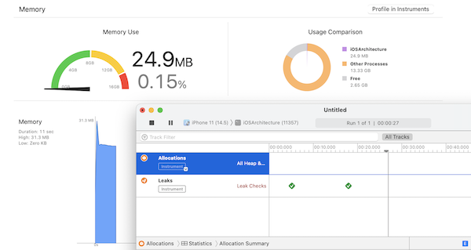

# iOSArchitecture

## Installation

Clone the repository:

`git clone https://github.com/zelin/iOSArchitecture.git`

Install pods:

`pod install`

## Architectures
This project demonstrates the use of MVVM architecture and multiple famous pattern for displaying stores list and their details. Firebase firestore database was implemented to fetch data from network.

### MVVM Pattern
🔒 Model-View-ViewModel (MVVM) is a structural design pattern that separates objects into three distinct groups:

• Models hold application data. They’re usually structs or simple classes.
• Views display visual elements and controls on the screen. They’re typically subclasses of UIView.
• View models transform model information into values that can be displayed on a view. They’re usually classes, so they can be passed around as references.

A more detailed explanation is presented in (https://www.raywenderlich.com/34-design-patterns-by-tutorials-mvvm)

### Repository Pattern

🔥 Repository pattern is a software design pattern that provides an abstraction of data, so that your application can work with a simple abstraction that has an interface.

A more detailed explanation is presented in (https://medium.com/tiendeo-tech/ios-repository-pattern-in-swift-85a8c62bf436)

### Coordinator Pattern

🍎 A coordinator is an object that bosses one or more view controllers around. Taking all of the driving logic out of your view controllers, and moving that stuff one layer up is gonna make your life a lot more awesome.

A more detailed explanation is presented in (https://www.hackingwithswift.com/articles/71/how-to-use-the-coordinator-pattern-in-ios-apps) and (https://khanlou.com/2015/10/coordinators-redux/)

### Dependency Injection

🔑 Dependency Injection is a practice where objects are designed in a manner where they receive instances of the objects from other pieces of code, instead of constructing them internally. This means that any object implementing the interface which is required by the object can be substituted in without changing the code, which simplifies testing, and improves decoupling.

For dependency injection, a lightweight library Resolver (https://github.com/hmlongco/Resolver) was used.

### Swift Lint

⚙️ A tool to enforce Swift style and conventions, loosely based on the now archived GitHub Swift Style Guide. SwiftLint enforces the style guide rules that are generally accepted by the Swift community. These rules are well described in popular style guides like Ray Wenderlich's Swift Style Guide.

Swiftlint is available at (https://github.com/realm/SwiftLint).

### Memory Management

⚡ Optimized the code for no memory leaks and low memory usage.

### Continuous Deployment (CD)

🚗 Using fastlane for continuous deployment

## Author

Muhammad Umar, https://github.com/zelin

## License

iOSArchitecture is available under the MIT license. See the LICENSE file for more info.
